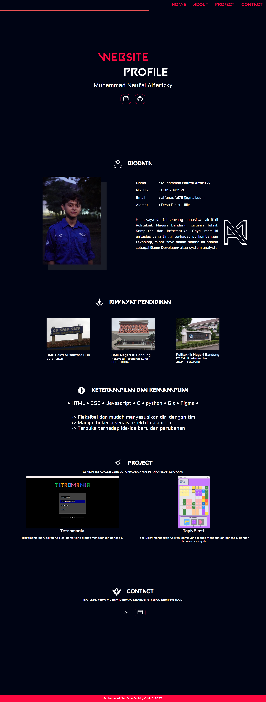

# 🌐 Responsive Portofolio Website - Muhammad Naufal Alfarizky

## Mission 1

## 📌 Deskripsi Proyek
Web portofolio ini dibuat untuk memenuhi tugas mata kuliah proyek 3. Website ini juga dapat menjadi landing page pribadi (CV/Portfolio) yang menampilkan informasi seperti :

- 👤 Data diri singkat
- 🎓 Riwayat pendidikan
- 🛠️ Skill dan kemampuan
- 📁 Project yang pernah dan sedang dikerjakan
- ✉️ Kontak untuk komunikasi

---

## 🛠️ Teknologi yang Digunakan
- **HTML5** → untuk struktur halaman  
- **CSS3** → untuk styling dan layout  
- **Custom Font (Valorant & Aldrich)** → menambah estetika tampilan  
- **Git & GitHub** → untuk version control dan dokumentasi  

---

## 🔧 Bukti Modifikasi CSS
Website ini tidak dibuat menggunakan framework CSS seperti Bootstrap atau Tailwind, seluruh tampilan website **dibuat secara custom menggunakan CSS murni**.

Beberapa poin penting modifikasi styling:
- Implementasi **custom font-face** (`Valorant` & `Aldrich`)  
- Penerapan **responsive design** dengan media queries
- Pembuatan **custom navigation bar**, card project, biodata table, serta button sosial media  
- Efek interaktif pada tombol & hover state  

---

## 👨‍💻 Tampilan

---

## 🚀 Deployment  

🔗 [Klik di sini untuk melihat website](https://alfanaufal.github.io/Portofolio-Web/)

---

## ✨Inspired from

🔗 [Inspirasi Desain](https://www.figma.com/community/file/1288804459741954497)

